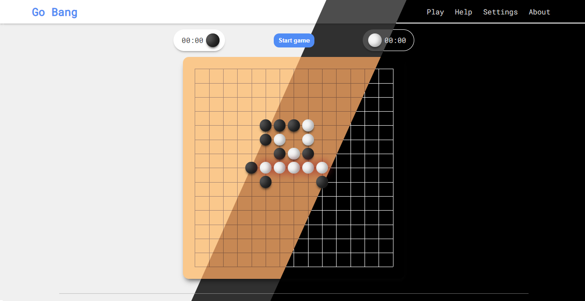

# GoBang

A minimalistic Go Bang (also known as: Five in a row, Wuziqi, Gomoku, 五子棋, 五目 etc.) game that runs on browser, developed using pure html/css and JavaScript. 

## Preview

## Future plans

Plan on adding the following features:

- Multiplayer matchmaking
- Settings for different variants and rules, and different timing methods
- AI
- Save and load game
- Account system with history

## Developer's Note

Developed for educational purposes by a small team of hobbyists. Feel free to redistribute.

